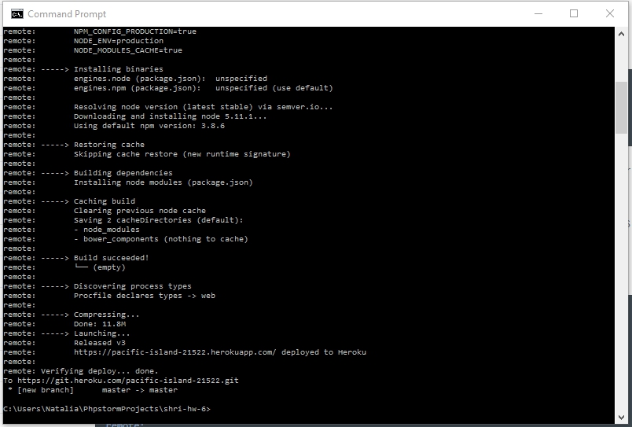
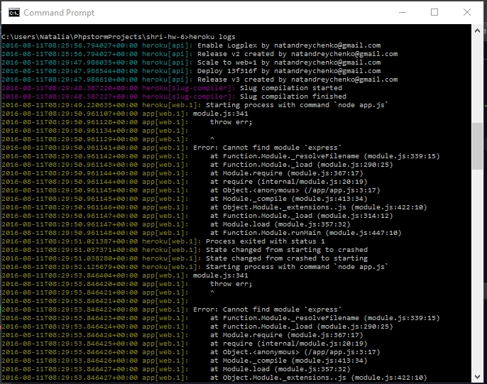

## Домашнее задание к лекции "Инфраструктура веб-проектов"

Добавила приложение, которое в зависимости от рандомно генерируемого числа выводит разные фигуры в canvas;
Настроила ESLint;
Выложила на хостинг Heroku:

Ссылка на приложение: https://pacific-island-21522.herokuapp.com/

Приложение сразу не загрузилось, потому что я в package.json зависимости указала как devDependencies, а не dependencies.
Узнала об ошибках через логи (не находился модуль express)

Настроила travis CI, Настроить деплой ветки master в Heroku, добавила плашку build.

Ссылка на travis: https://travis-ci.org/iNata/shri-hw-6
