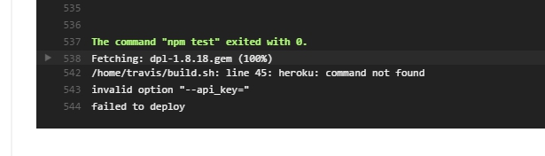

## Домашнее задание к лекции "Инфраструктура веб-проектов"

Добавила приложение, которое в зависимости от рандомно генерируемого числа выводит разные фигуры в canvas;

Настроила ESLint; 
Исправила ошибки ESLint, но пришлось удалить проверку linebreak-style, так как работаю на windows, который переносит
строки CRLF, соот. локально ошибок не было, а на хостинге возникли ошибки переноса строк.

Выложила на хостинг Heroku:

Ссылка на приложение: https://pacific-island-21522.herokuapp.com/

Приложение сразу не загрузилось, потому что я в package.json зависимости указала как devDependencies, а не dependencies.
Узнала об ошибках через логи (не находился модуль express)

Настроила travis CI, добавила плашку build.

Ссылка на travis: https://travis-ci.org/iNata/shri-hw-6

Сразу не получилось настроить деплой ветки master в Heroku через Travis. Согласно отчету Travis build'а не распознавался
api_key heroku. 
 

Удалила содержимое .travis.yml, из консоли залогинилась в heroku account, добавила api key, название приложения. Последующий 
коммит сбилдился успешно.

Настроила облачный линтер BitHound;